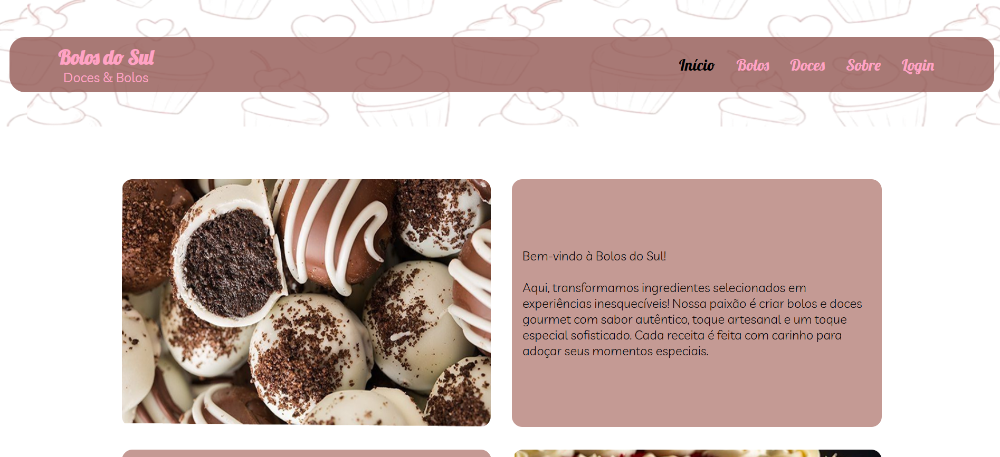

# 🎂 Bolos do Sul

Projeto web desenvolvido para a confeitaria fictícia Bolos do Sul, para fins de divulgação do negócio e de seus produtos.
Layout das páginas, foi baseado no design que foi criado para a empresa e está disponível no [Figma](https://www.figma.com/design/pteLAd8RXnIxgQHO36j7eI/site-bolo?node-id=0-1&p=f&t=cNwmKAEXzt7ENQTX-0).

## 🎨 Captura de Tela

## 🖥️ Visualize o projeto

[https://luhring-julian.github.io/html-pastry-shop-web/](https://luhring-julian.github.io/html-pastry-shop-web/)

## ️⚙️ Tecnologias Usadas

- HTML5
- CSS3

## ️🛠️ Melhorias Futuras

- Implementação da responsividade 📱

#

Feito por [Julian Luhring](https://github.com/luhring-julian).

Este projeto foi criado para fins de aprendizado e portfólio.
